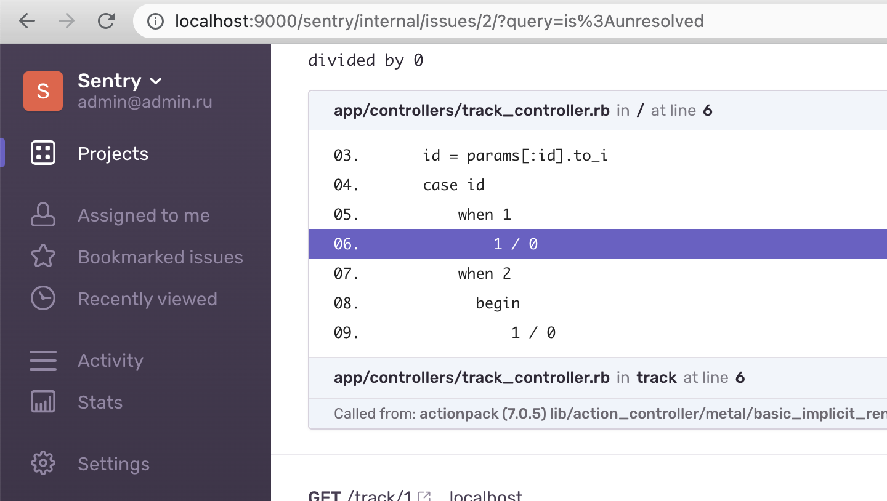
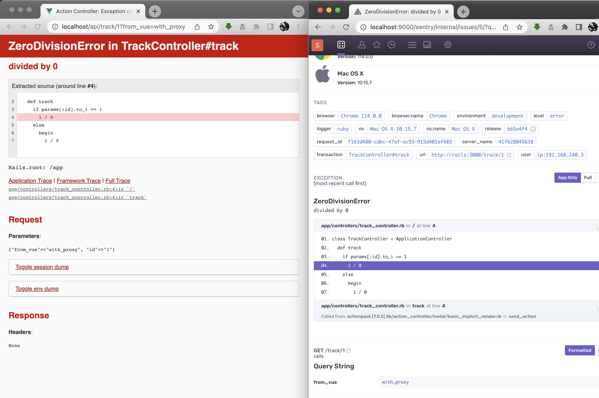
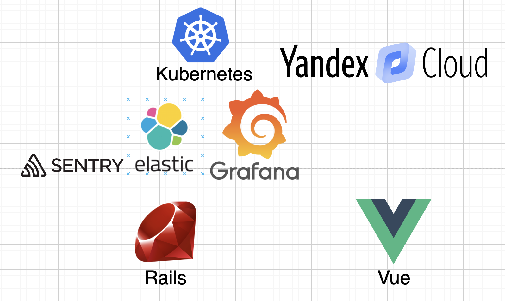

# rails_stand 
Practices with architecture development

# Сформировать docker образы
```
make build
```

# Подключиться к контейнеру **sentry**, запустить миграции и создать пользователя

```
make init
```

# Запустить/остановить все сервисы
```
make start
make stop
```

# Sentry (локальный, без покупки внешних тарифов https://sentry.io/pricing/)



# Vue с внутренним перенаправлением на сервер rails (proxy)



# План тренировки



